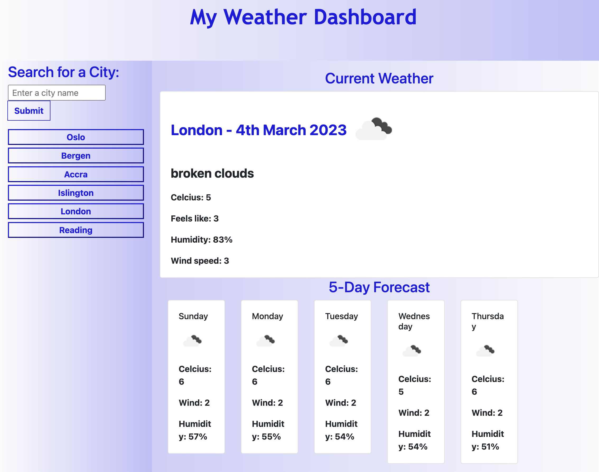

# My Weather Dashboard

  

## Table Of Content

- [Description](#description)
- [Deployed website link](#deployedWebsite)
- [Installation](#installation)
- [Usage](#usage)
- [GitHub](#github)
- [Contact](#contact)
- [License](#license)

  

## Description

  This weather dashboard is a web application that allows users to search for the current and future weather conditions for a specific city. When a user searches for a city, the application displays the current weather conditions for that city, including the city name, date, an icon representation of the weather conditions, temperature, humidity, and wind speed. In addition, the application also displays a 5-day forecast that includes the date, an icon representation of the weather conditions, temperature, and humidity.

The application also includes a search history, where a user's search history is saved to local storage. When a user clicks on a city in the search history, the current and future weather conditions for that city are displayed.

The weather data is obtained through the OpenWeatherMap API. The application uses jQuery and AJAX to retrieve the weather data and dynamically update the HTML of the page.

 

### What I learnt

In the process of building this project, I learnt a lot about APIs, specifically how to use APIs in designing and implementing user interfaces, and managing project dependencies. I also learned about the importance of testing in the development process, as well as the benefits of using version control systems to manage code changes. Overall, this project was a great learning experience that helped me develop valuable skills that we can apply to future projects.

Deployed website: <strong><a href="https://antonscheving.github.io/My-Weather-Dashboard/">https://antonscheving.github.io/My-Weather-Dashboard/</a></strong>

 

   
MT Weather Dashboard website screenshot

## Installation

To use My Weather Dashboard, simply download the files from the gitHub repository and open the index.html file in a web browser.

My Weather Dashboard is built with the following tools and libraries: <ul><li>HTML</li> <li>CSS</li> <li>JavaScript</li>Moment.js</li> <li>Bootstrap</li></ul>

 

## Usage
 
Enter the name of a city into the search bar and press the search button. The current weather conditions for that city will be displayed, including the city name, date, an icon representation of weather conditions, temperature, humidity, and wind speed. Additionally, a 5-day forecast will be shown with the date, an icon representation of weather conditions, temperature, and humidity.

If the user clicks on a city in the search history, they will again be presented with current and future conditions for that city.

Note: This weather dashboard uses the OpenWeather API to retrieve weather data. In order to use the application, you will need to obtain an API key from OpenWeather and replace the existing key in the code with your own.

 

## GitHub

<a href="https://github.com/AntonScheving"><strong>AntonScheving</a></strong>

Visit my website: <strong><a href="www.antonscheving.com">AntonScheving.com</a></strong>

 

## Contact

Feel free to reach out to me on my email:
anton@scheving.email

 

## License

